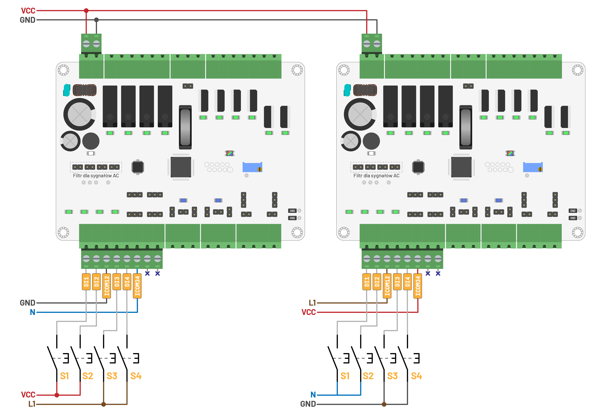

# 🕹️ General IO [➥](../readme.md)

W przykładach zostanie przedstawiona tylko obsługa pętli `loop`, pomijając `#include`, deklaracje stosów pamięci `stack` oraz funkcji `main`, która inicjuje wątki, ponieważ w każdym z przykładów te fragmenty będą identyczne.

```c
// Import podstawowych funkcji sterownika.
#include "opencplc-uno.h"

// Stos pamięci dla wątku PLC
static uint32_t stack_plc[256];
// Stos pamięci dla funkcji loop
static uint32_t stack_loop[256];

void loop(void)
{
  // TODO: Przykład
}

int main(void)
{
  // Inicjacja sterownika
  PLC_Init(); 
  // Dodanie wątku sterownika
  thread(&PLC_Thread, stack_plc, sizeof(stack_plc));
  // Dodanie funkcji loop jako wątek
  thread(&loop, stack_loop, sizeof(stack_loop));
  // Włączenie systemy przełączania wątków VRTS
  VRTS_Init();
  // W to miejsce program nigdy nie powinien dojść
  while(1);
}
```

## Wyjścia cyfrowe

### 🚨 Dioda `LED`

W pierwszych krokach zwarto uruchomić program, który nie wymaga podłączania żadnych urządzeń zewnętrznych. Programem takim jest sterowanie diodą **LED**. Może ona informować użytkownika o stanie urządzenia oraz występujących błędach. Wywołując funkcję `LED_Set`, należy przekazać kolor, który chcemy ustawić _(`RGB_Red`, `RGB_Green`, `RGB_Blue`, `RGB_Yellow`, `RGB_Cyan`, `RGB_Magenta`,  `RGB_White`)_. Funkcją `LED_Rst` wyłączamy diodę.

```c
void loop(void)
{
  while(1) {
    // Ustawienie diody informacyjnej, aby świeciła na czerwoną
    LED_Set(RGB_Red);
    delay(1000); // Odczekaj 1s
    // Ustawienie diody informacyjnej, aby świeciła na zieloną
    LED_Set(RGB_Green);
    delay(1000); // Odczekaj 1s
    // Ustawienie diody informacyjnej, aby świeciła na niebieską
    LED_Set(RGB_Blue);
    delay(1000); // Odczekaj 1s
    // Wyłącz diodę
    LED_Rst();
    delay(1000); // Odczekaj 1s
  }
}
```

🚀 Kompletny przykład: [Dioda LED włącz i wyłącz](./example/io/led-set-rst.c)

Ponieważ oko ludzkie lepiej reaguje na zmiany obrazu, popularną praktyką jest miganie lampkami informacyjnymi, co pozwala lepiej zwrócić uwagę na ewentualne błędy. Miganie można aktywować za pomocą funkcji `LED_Blink_ON`, przekazując czas w **ms** między zmianami stanu diody. Miganie można w każdej chwili wyłączyć za pomocą funkcji `LED_Blink_OFF`.

```c
void loop(void)
{
  // Zmienna pomocnicza przechowująca stan, określająca czy dioda ma migać
  // dla wartości `true`, czy świecić ciągłym światłem dla wartości `false`.
  bool blink = true;
  while(1) {
    if(blink) {
      // Włączenie migania z częstotliwością zmiany stanu diody wynoszącą 200ms
      LED_Blink_ON(200); 
    }
    else {
      // Wyłączenie migania diody (dioda będzie świecić ciągłym światłem)
      LED_Blink_OFF();
    }
    // Ustawienie diody informacyjnej, na kolor czerwony
    LED_Set(RGB_Red);
    delay(3000); // Odczekaj 3s
    // Ustawienie diody informacyjnej, na kolor zielony
    LED_Set(RGB_Green);
    delay(3000); // Odczekaj 3s
    // Ustawienie diody informacyjnej, na kolor niebieski
    LED_Set(RGB_Blue);
    delay(3000); // Odczekaj 3s  
    // Zmiana trybu z migania na świecenie i odwrotnie
    blink = !blink;
  }
}
```

🚀 Kompletny przykład: [Dioda LED miganie](./example/io/led-blink.c)

Jednak, gdy chcemy szybko wskazać na jakieś zdarzenie, dobrze jest wykonać pojedyńcze mignięcie wykorzystując funkcję `LED_OneShot`, która ustawia diodę na określony kolor i wyłącza ją po podanym czasie.

```c
void loop(void)
{
  while(1) {
    // Wykonaj pojedyncze mignięcie diodą czerwoną trwające 100ms
    LED_OneShoot(RGB_Red, 100);
    delay(2000); // Odczekaj 2s
    // Wykonaj pojedyncze mignięcie diodą zieloną trwające 300ms
    LED_OneShoot(RGB_Green, 300);
    delay(2000); // Odczekaj 2s
    // Wykonaj pojedyncze mignięcie diodą niebieską trwające 600ms
    LED_OneShoot(RGB_Blue, 600);
    delay(2000); // Odczekaj 2s
  }
}
```

🚀 Kompletny przykład: [Dioda LED pojedyńcze mignięcie](./example/io/led-one-shot.c)

### 🐢 Wyjścia przekaźnikowe `RO`

Włączanie / wyłącznie wyjścia

```c
#include "opencplc-uno.h"

static uint32_t stack_plc[256];
static uint32_t stack_loop[256];

void loop(void)
{
  while(1) {
    DOUT_Set(&RO1);
    delay(3000);
    DOUT_Rst(&RO1);
    delay(3000);
  }
}

int main(void)
{
  PLC_Init();
  thread(&PLC_Thread, stack_plc, sizeof(stack_plc));
  thread(&loop, stack_loop, sizeof(stack_loop));
  VRTS_Init();
  while(1);
}
```

Ten sam efekt możemy uzyskać zmieniając stan wyjścia 

```c
#include "opencplc-uno.h"

static uint32_t stack_plc[256];
static uint32_t stack_loop[256];

int main(void)
{
  PLC_Init();
  thread(&PLC_Thread, stack_plc, sizeof(stack_plc));
  thread(&loop, stack_loop, sizeof(stack_loop));
  VRTS_Init();
  while(1);
}

void loop(void)
{
  while(1) {
    DOUT_Tgl(&RO1);
    delay(1000);
  }
}
```

Jak również stosując zmienną pomocniczą

```c
#include "opencplc-uno.h"

static uint32_t stack_plc[256];
static uint32_t stack_loop[256];

int main(void)
{
  PLC_Init();
  thread(&PLC_Thread, stack_plc, sizeof(stack_plc));
  thread(&loop, stack_loop, sizeof(stack_loop));
  VRTS_Init();
  while(1);
}

void loop(void)
{
  bool state = false;
  while(1) {
    DOUT_Preset(&RO1, state);
    delay(1000);
    state = !state;
  }
}
```

### 🐇 Wyjścia tranzystorowe `TO` i triakowe `XO`

Pulse

```c
#include "opencplc-uno.h"

static uint32_t stack_plc[256];
static uint32_t stack_loop[256];

int main(void)
{
  PLC_Init();
  thread(&PLC_Thread, stack_plc, sizeof(stack_plc));
  thread(&loop, stack_loop, sizeof(stack_loop));
  VRTS_Init();
  while(1);
}

void loop(void)
{
  uint8_t x = 100;
  while(1) {
    if(x >= 100) {
      DOUT_Pulse(&RO1, 1000);
    }
    delay(5)
  }
}
```

Płynna regulacja mocą

```c
#include "opencplc-uno.h"

static uint32_t stack_plc[256];
static uint32_t stack_loop[256];

int main(void)
{
  PLC_Init();
  thread(&PLC_Thread, stack_plc, sizeof(stack_plc));
  thread(&loop, stack_loop, sizeof(stack_loop));
  VRTS_Init();
  while(1);
}

void loop(void)
{
  TO_Frequency(200); // 200Hz
  XO_Frequency(1);   // 1Hz
  float value = 0;
  while(1) {
    DOUT_Duty(&TO1, value);
    DOUT_Duty(&XO1, value);
    delay(10);
    value += 0.1;
    if(value > 100) value = 0;
  }
}
```

## ⌨️ Wejścia cyfrowe **`DI`**

Wejścia cyfrowe nieco odbiegają od standardów automatyki, umożliwiając traktowanie sygnału **12V** jako logicznej `1`. Głównie w celu obsługi pojazdów przemysłowych, takich jak podnośniki, koparki i dźwigi.

| Standard   | logiczne `0` |  stan nieustalony  | logincza `1`  |
| :--------- | :----------- | :----------------- | :------------ |
| Automatyka | poniżej `5V` | od `5VDC` do `15V` | powyżej `15V` |
| OpenCPLC   | poniżej `4V` | od `4VDC` do `9V`  | powyżej `9V`  |

Oczywiście, możemy sterować zarówno napięciem przemiennym **230VAC**, jak i międzyfazowym **400VAC**. Jednak podczas sterowania napięciem przemiennym konieczne jest umieszczenie zworki na styku **`ACx`**, gdzie **`x`** jest numerem wejścia cyfrowego.

Dla wystąpienia stanu wysokiego kluczowy jest przepływ prądu pomiędzy wejściem cyfrowym **`DIx`**, a powiązanym z nim potencjałem **`ICOM`**, który zazwyczaj jest wspólny dla kilku wejść. W sterowniku **Uno** są **4** wejścia podzielone na **2** grupy, z przypisanym portem `ICOM` dla każdej z nich. W przykładzie `ICOM12` jest podłączony do potencjału masy `GND`, a wejścia `DI1` i `DI2` są podłączone do zasilania przez przełącznik. Z kolei `ICOM34` jest podłączony do sygnału neutralnego `N`, a wejścia `DI3` i `DI4` są podłączone do fazy `L1` przez przełącznik. W podłączeniu wejść cyfrowych można zamienić `GND` i `VCC` oraz `N` i `L1` między sobą, jeśli zajdzie taka potrzeba.



Podstawową funkcją, która informuje nas o stanie wyjścia, jest `DIN_State`. Zwraca wartość `1`|`true`, jeśli sygnał występuje, oraz wartość `0`|`false`, jeśli nie występuje.

```c
#include "opencplc-uno.h"

static uint32_t stack_plc[256];
static uint32_t stack_loop[256];

void loop(void)
{
  while(1) {
    if(DIN_State(&DI1)) {
      DOUT_Set(&RO1);
    }
    else {
      DOUT_Rst(&RO1);
    }
  }
}

int main(void)
{
  PLC_Init();
  thread(&PLC_Thread, stack_plc, sizeof(stack_plc));
  thread(&loop, stack_loop, sizeof(stack_loop));
  VRTS_Init();
  while(1);
}
```

Jednak w praktyce 


<!-- Poza tym odstępstwem  -->

Detekcja stanu wyjścia oraz czasy tin tout

```c
#include "opencplc-uno.h"

static uint32_t stack_plc[256];
static uint32_t stack_loop[256];

void loop(void)
{
  while(1) {
    if(DIN_Rais(&DI1)) {
      DOUT_Set(&RO1);
    }
    if(DIN_Fall(&DI2)) {
      DOUT_Rst(&RO1);
    }
    if(DIN_Edge(&DI3)) {
      // DOUT_Tgl(&RO1);
    }
  }
}

int main(void)
{
  DI1.gpif.ton_ms = 100;
  DI1.gpif.toff_ms = 500;
  PLC_Init();
  thread(&PLC_Thread, stack_plc, sizeof(stack_plc));
  thread(&loop, stack_loop, sizeof(stack_loop));
  VRTS_Init();
  while(1);
}
```

Detekcja zbocza

```c
#include "opencplc-uno.h"

static uint32_t stack_plc[256];
static uint32_t stack_loop[256];

int main(void)
{
  DI1.gpif.ton_ms = 100;
  DI1.gpif.toff_ms = 500;
  PLC_Init();
  thread(&PLC_Thread, stack_plc, sizeof(stack_plc));
  thread(&loop, stack_loop, sizeof(stack_loop));
  VRTS_Init();
  while(1);
}

void loop(void)
{
  DI1.gpif.toggle_ms = 2000;
  PLC_Init();
  while(1) {
    if(DIN_Toggling(&DI1)) {
      DOUT_Set(&RO1);
    }
    else {
      DOUT_Rst(&RO1);
    }
  }
}
```

Detekcja zmiany stanu

```c
#include "opencplc-uno.h"

static uint32_t stack_plc[256];
static uint32_t stack_loop[256];

int main(void)
{
  DI1.gpif.toggle_ms = 2000;
  PLC_Init();
  thread(&PLC_Thread, stack_plc, sizeof(stack_plc));
  thread(&loop, stack_loop, sizeof(stack_loop));
  VRTS_Init();
  while(1);
}

void loop(void)
{
  while(1) {
    if(DIN_Toggling(&DI1)) {
      DOUT_Set(&RO1);
    }
    else {
      DOUT_Rst(&RO1);
    }
  }
}
```

Obsługa przycisku

```c
#include "opencplc-uno.h"

static uint32_t stack_plc[256];
static uint32_t stack_loop[256];

void loop(void)
{
  RGB_e color = RGB_Off;
  while(1) {
    if(DIN_Fall(&BTN)) {
      color++;
      if(color > RGB_END_COLOR) color = RGB_Off;
      LED_Set(color);
    }
    let();
  }
}

int main(void)
{
  PLC_Init();
  thread(&PLC_Thread, stack_plc, sizeof(stack_plc));
  thread(&loop, stack_loop, sizeof(stack_loop));
  VRTS_Init();
  while(1);
}
```

### Wejścia analogowe **`AI`**

W sterowniku **Uno** mamy do dyspozycji 2 wejścia analogowe `AI1` i `AI2`. Wejście analogowe pozwala na pomiar wartości napięcia w zakresie **0-10V**, gdy pole type jest ustawione na `AIN_Type_Volts` _(domyślnie)_, prądu w zakresie **0-20mA**, gdy pole type jest ustawione na `AIN_Type_mAmps`, lub wartość w procentach `AIN_Type_Percent`, gdzie maksynalne wartości prądu i napięcia są skalowane do **100%**. Funkcją, która zwraca nam zmierzoną wartość, jest `AIN_Value`.  W przykładzie pobierana jest wartość prądu, sprawdzane jest, czy nie jest ona mniejsza niż **2mA**, co wskazywałoby na brak podpiętego czujnika, a następnie prąd jest przeliczany na temperaturę.

Wersja 1. Podejście `Linear function`

```c
#include "opencplc-uno.h"

AIN_t *analog_input = &AI1;

#define TEMPERATURE_MIN_4mA  -40.0 // [°C]
#define TEMPERATURE_MAX_20mA 125.0 // [°C]

int main(void)
{
  analog_input->type = AIN_Type_mAmps;
  PLC_Init();
  float a = (TEMPERATURE_MAX_20mA - TEMPERATURE_MIN_4mA) / (20 - 4);
  float b = TEMPERATURE_MIN_4mA - (a * 4);
  while(1) {
    float current_mA = AIN_Value(analog_input);
    float temperature = -273;
    if(current_mA < 2) {
      // ERROR
    }
    else {
      temperature = (a * current_mA) + b;
      // TODO: use temperature
    }
    PLC_Loop();
  }
}
```

Wersja 2. Podejście `PLC style`

```c
#include "opencplc-uno.h"

// Define the analog input pointer
AIN_t *analog_input = &AI1;

// Define temperature range constants
#define TEMPERATURE_MIN  -60.0 // [°C]
#define TEMPERATURE_MAX 100.0 // [°C]

// Define the scaling parameters
#define INPUT_MIN 4.0 // Minimum sensor input in mA
#define INPUT_MAX 20.0 // Maximum sensor input in mA
#define ERROR_THRESHOLD 2.0 // Error threshold in mA
#define ERROR_VAL -273.0 // [°C]

int main(void)
{
  // Set the analog input type
  analog_input->type = AIN_Type_mAmps;

  // Initialize the PLC
  PLC_Init();

  while(1) {
    float current_mA = AIN_Value(analog_input);
    float normalized_current = (current_mA - INPUT_MIN) / (INPUT_MAX - INPUT_MIN);
    float temperature;
    if (current_mA < ERROR_THRESHOLD) {
      temperature = ERROR_VAL;
      // Some other error handling
    } else {
      // Otherwise, calculate temperature based on the current value
      temperature = TEMPERATURE_MIN + normalized_current * (TEMPERATURE_MAX - TEMPERATURE_MIN);
      // TODO: use temperature
    }
    // Run the PLC loop
    PLC_Loop();
  }
}
```